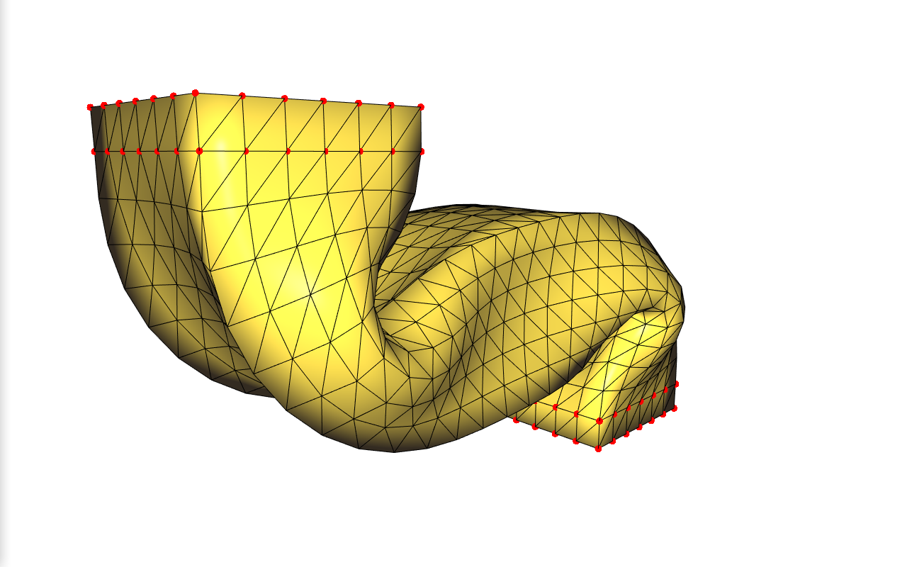

# ARAP
Implementation of the paper As-Rigid-As-Possible Surface Modeling written by Olga Sorkine-Hornung and Marc Alexa.

Some meshes are presented in `code/data` and constraints for them are set.

# How to run

## Requirements:

libigl version 2.3.0: https://github.com/libigl/libigl/tree/v2.3.0 


## To build on Linux / Mac:
```
mkdir code/build
cd code/build
cmake ..
make
```

## To run
```
./ex_bin path/to/the/mesh
```

## Results


[Report](report/ARAP-Chaussonnier_Romain-Pilipyuk_Alexandra.pdf)

# Done by
Romain Chausonnier

Alexandra Pilipyuk
